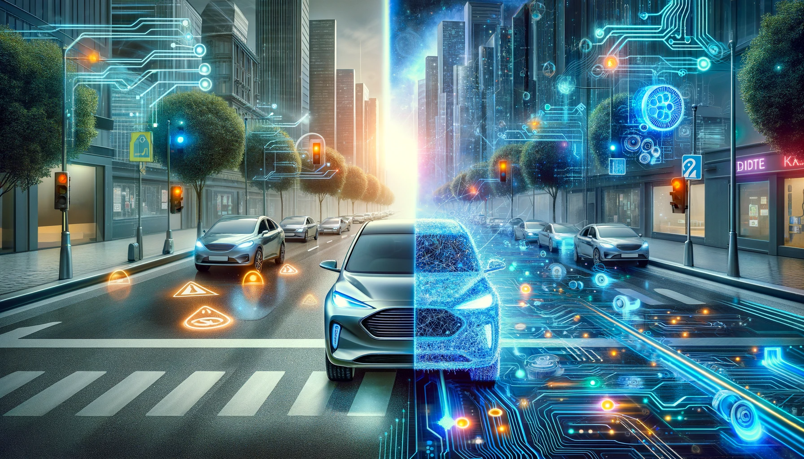
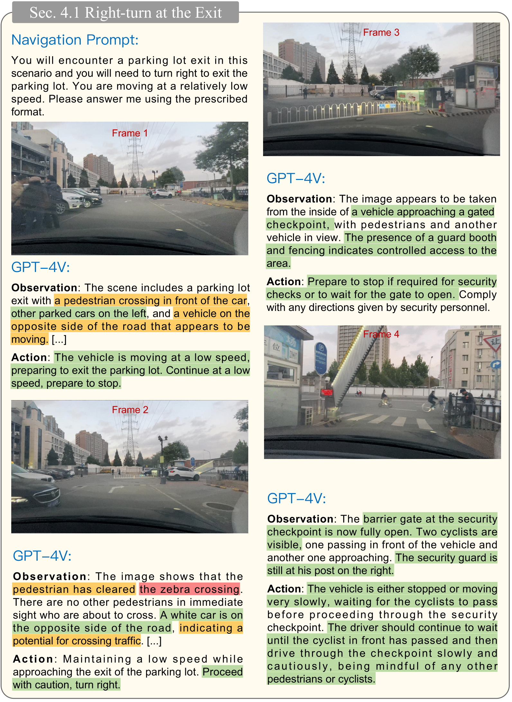

# On the Road with GPT-4V(ision) 👁️

[](https://arxiv.org/abs/2311.05332)


This is the official repository for the technical report: **On the Road with GPT-4V(ision): Early Explorations of Visual-Language Model on Autonomous Driving**.



## 📰 News

- 2023/11/10 The technical report is now available on [arXiv](https://arxiv.org/abs/2311.05332)!

## 📌 Introduction

In our report, we explore the revolutionary GPT-4V, a visionary in the field of autonomous driving. Here, you'll find a treasure trove of original test images and in-depth results demonstrating the model's capabilities in understanding complex driving scenes and making decisions like a seasoned driver.

## 🖼 Illustrations

Here's a glimpse into some of the fascinating results from our report:

- **Weather Understanding**: This image showcases GPT-4V's capability to understand different weather conditions, a critical factor in autonomous driving.
  
  


- **Corner Cases**: An illustration of how GPT-4V handles complex and unusual traffic scenarios, which are often challenging for autonomous systems.

  

- **Act as a Driver**: A demonstration of GPT-4V acting in the capacity of a driver, making decisions in real-world driving situations.

  

## 🚀 Usage

Dive into our insightful findings by exploring the categorized directories:

- `Scenario Understanding`: Tests on GPT-4V's perception of its environment and fellow road-goers.
- `Reasoning`: A peek into the model's advanced reasoning capabilities.
- `Act as A Driver`: Scenes where GPT-4V showcases its driving acumen.

Each case within these categories is accompanied by a `.json` file detailing the prompts and responses from GPT-4V, alongside a `.png` image that the model assessed.

## 🤝 Contributions

Your thoughts and contributions are a green signal for us! 🚦

If you have suggestions or additional insights, **feel free to open an issue or submit a pull request**.

## 📜 Citation

If our repository accelerates your research, please use the following citation:

```bibtex
@article{wen2023road,
  title={On the Road with GPT-4V(ision): Early Explorations of Visual-Language Model on Autonomous Driving},
  author={Licheng Wen and Xuemeng Yang and Daocheng Fu and Xiaofeng Wang and Pinlong Cai and Xin Li and Tao Ma and Yingxuan Li and Linran Xu and Dengke Shang and Zheng Zhu and Shaoyan Sun and Yeqi Bai and Xinyu Cai and Min Dou and Shuanglu Hu and Botian Shi},
  journal={arXiv preprint arXiv:2311.05332},
  year={2023}
}
```

## 🌟 Other Awesome Projects from Our Team

Our team is actively involved in various innovative projects in the realm of autonomous driving. Here are some other exciting repositories that you might find interesting:

- **[Awesome Knowledge-Driven Autonomous Driving](https://github.com/PJLab-ADG/awesome-knowledge-driven-AD)** 

- **[Drive Like a Human](https://github.com/PJLab-ADG/driveLikeAHuman)** 

- **[DiLu](https://github.com/PJLab-ADG/DiLu)** 


## 📄 License

The content of this repository is under the hood of an [MIT License](https://github.com/PJLab-ADG/GPT4V-AD-Exploration/blob/main/LICENSE).
